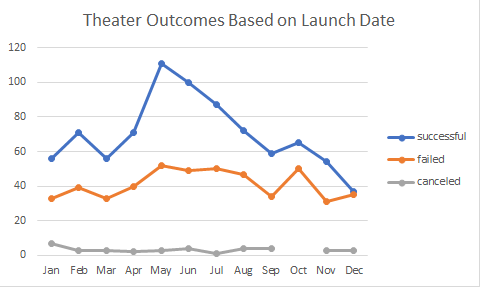
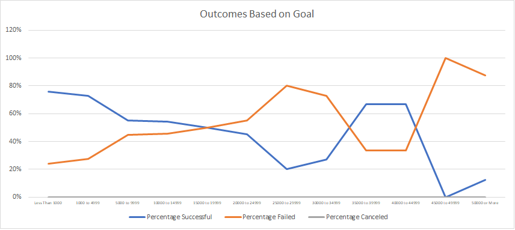

# HomeworkWK1
# Kickstarting with Excel

## Overview of Project
We will be using the information from Kickstarter to find any relationship between a funding range, launch dates, and successful outcome.  
### Purpose
This analysis is to determine the best launch date and funding range to achieve their funding goal. 
## Analysis and Challenges

### Analysis of Outcomes Based on Launch Date
The analysis showed the best launch date to be in the second and third quarters. The best individual month was May. Launching late spring early summer would give a great chance on reaching the desired fundraising goal. 
### Analysis of Outcomes Based on Goals
There was a split range of success rates: 1. Having a goal of less than $1,000 had a success rate of 75% decreasing gradually to 50% when reaching $15,000. 2. Having a goal from $35,000 to $50,000 had a success rate of 67%. Picking a funding range based on these 2 options above gives over a 50% chance of success. 

### Challenges and Difficulties Encountered
Some challenges I encountered were getting the Outcomes Based on Launch Date to show in months. I learned the "grouping" option helps you change this data from years to months. Another challenge I had was using the correct parameters for the "countifs" function. The video on Canvas did a great job explaining how the parameters were to be entered.
## Results

- What are two conclusions you can draw about the Outcomes based on Launch Date?

 1. The best time to launch a play would be in May. May had the most successful launch dates of the entire years. 
 2. The worst time to launch a play would be in December. December had the worst successful launch dates for the years. 

- What can you conclude about the Outcomes based on Goals?

 The lower goal was more attainable versus the higher goal marks. When creators are creating a play, a lower budget will have a high chance of attaining its fundraiser goal.

- What are some limitations of this dataset?

 These are only based off launch dates and donations. There are more factors to making a play or show successful when dealing with fundraisers. A big part of reaching a fundraiser goal deals with awareness and presentation. People will invest into a fundraiser that would appeal to them. This will need more information on the audience to determine the age range to be as appealing as possible. 

- What are some other possible tables and/or graphs that we could create?

 We could use a column or bar chart. These charts give great representation for side-by-side comparison. 
